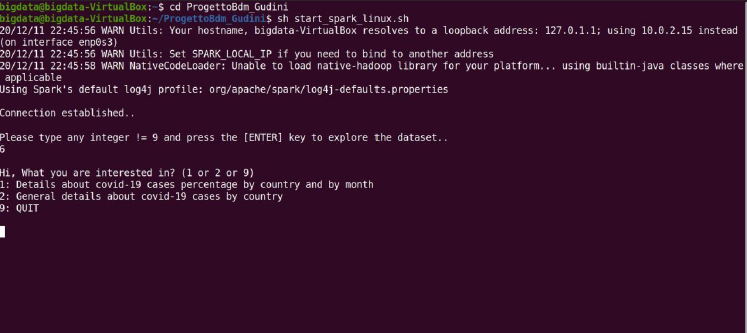
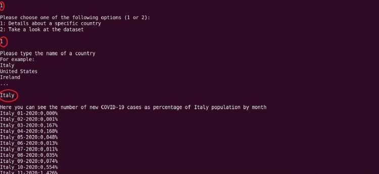

# Batch-processing-of-COVID-19-data-trough-Apache-Spark-analytics-engine

## Introduction

In this project, a csv-format dataset containing information on new coronavirus cases recorded daily for each nation over a time interval of approximately 11 months (late December 2019 to November 2020) was considered. It can be found at the following link: https://ourworldindata.org/coronavirus-source-data and contains over 50000 records. The table below shows the columns (with their description) of interest for this project:

| Column name | Description                                          |
|-------------|------------------------------------------------------|
| Location    | Nation                                               |
| Date        | yyyy/mm/dd                                           |
| new_cases   | New positives                                        |
| Population  | Number of inhabitants                                |

The goal of this project was to create a simple command-line application that can provide the end user with different types of information from the dataset. Java and Apache Spark were used to develop the application.

## Use Case

* Windows OS:

1. Double click on "start_spark" batch file
2. Once the app is running just follow the instructions that will appear on the terminal

* Linux:

1. Launch your terminal and move into this directory
2. Type: sh start_spark_linux.sh
3. Once the app is running just follow the instructions that will appear on the terminal

Once the application starts, the following screen appears:

At each step of program execution, it is possible for the user to choose from several options, either by typing a number or entering a string when prompted, as shown in the figure below:

Please remember that the app is case sensitive

While the app is running some warnings may occur but you can safely ignore them